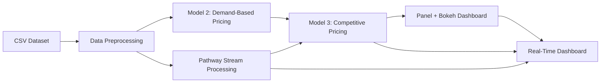

# Dynamic Pricing for Urban Parking Lots

## 🚀 Project Overview

Urban parking spaces are scarce. This project implements a **real-time dynamic pricing engine** for 14 parking lots, adapting prices to demand (occupancy, queue length, traffic, special events, vehicle type) and local competition (nearby lot capacities and prices). An interactive Panel+ Bokeh dashboard and Pathway-based streaming simulation demonstrate end-to-end functionality.

## 🛠️ Tech Stack

* **Python 3.9+**
* **Pandas**, **NumPy** for data processing
* **Panel**, **Bokeh** for interactive visualizations
* **Pathway** for real-time data streaming
* **Mermaid** for architecture diagrams (in README)
* **Git** & **GitHub** for version control

## 📐 Architecture Diagram



## 🏗️ Architecture & Workflow

1. **Data Ingestion**: Load `dataset.csv`, merge `LastUpdatedDate` & `LastUpdatedTime` into a `Timestamp`, sort.
2. **Feature Encoding**: Map `VehicleType` and `TrafficConditionNearby` to numeric weights.
3. **Model 2 - Demand-Based**:

   * Compute `Demand = α*(Occupancy/Capacity) + β*QueueLength - γ*Traffic + δ*IsSpecialDay + ε*VehicleTypeWeight`.
   * Normalize demand and calculate `Price = BasePrice * (1 + λ * NormalizedDemand)`.
4. **Model 3 - Competitive Pricing**:

   * Apply Haversine formula to locate lots within 1 km.
   * If current lot >90% capacity & competitors cheaper → lower price.
   * If competitors >80% capacity & higher price → raise price.
5. **Interactive Dashboard**:

   * Panel widget for selecting a lot.
   * Bokeh time-series comparing Model 2 vs Model 3 prices.
6. **Real-Time Streaming (Pathway)**:

   * Export streaming CSV and infer schema via `pw.schema_from_csv`.
   * Register UDFs for base and competitive pricing.
   * Stream records, apply pricing logic on the fly.
   * Render live table or integrate into a web dashboard.

## 📂 Repository Structure

```
├── dataset.csv
├── Dynamic_Pricing_Submission.ipynb
├── bokeh_dynamic_pricing.html
├── src/
│   ├── data_preprocessing.py
│   ├── pricing_models.py
│   ├── dashboard.py
│   └── streaming.py
├── README.md
└── requirements.txt
```

## 📝 Usage

1. **Clone repo**:

   ```bash
   ```

git clone <repo-url>
cd dynamic-pricing

````
2. **Install dependencies**:
   ```bash
pip install -r requirements.txt
````

3. **Run Notebook**:

   ```bash
   ```

jupyter lab Dynamic\_Pricing\_Submission.ipynb

````
4. **Launch Dashboard** (in Jupyter):
   Execute the Panel cell or run:
   ```bash
panel serve src/dashboard.py --show
````

5. **Start Stream**:

   ```bash
   ```

panel serve src/streaming.py --show

```

## 📈 Results & Screenshots
*(Include GIFs or screenshots under `docs/screenshots/`)*

## 🔮 Future Improvements
- Add ML forecasting for next-hour demand.
- Integrate rerouting suggestions and notifications.
- Deploy with Docker on Kubernetes for scalability.
- Add authentication & multi-user support.

## 🤝 Contributing
Contributions welcome! Please open issues or pull requests.

## 📄 License
MIT License ©️ [Your Name]

```
